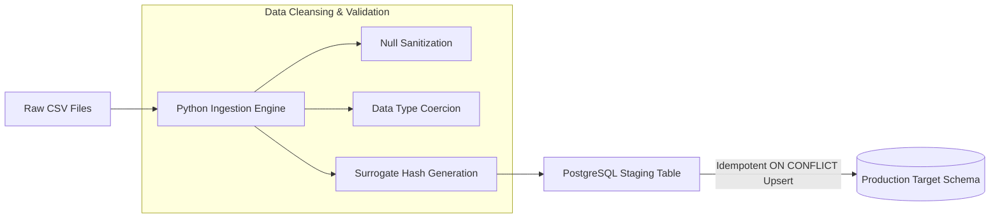
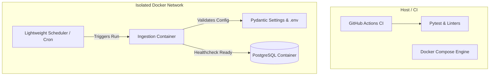
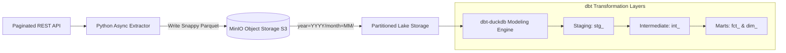
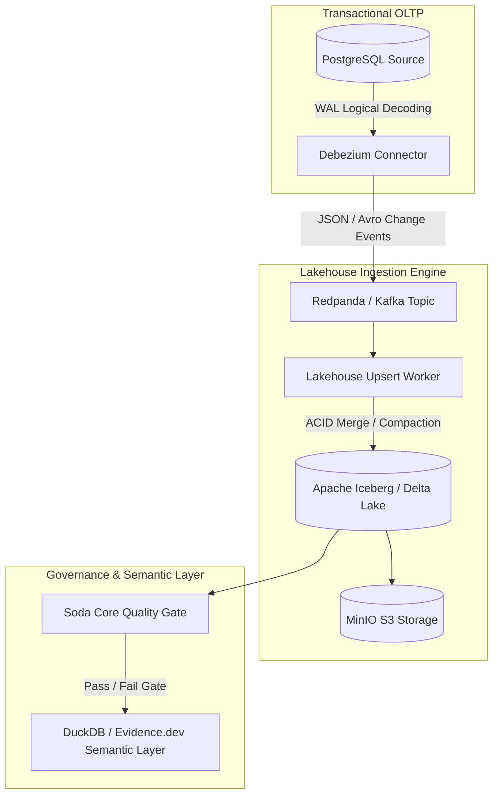
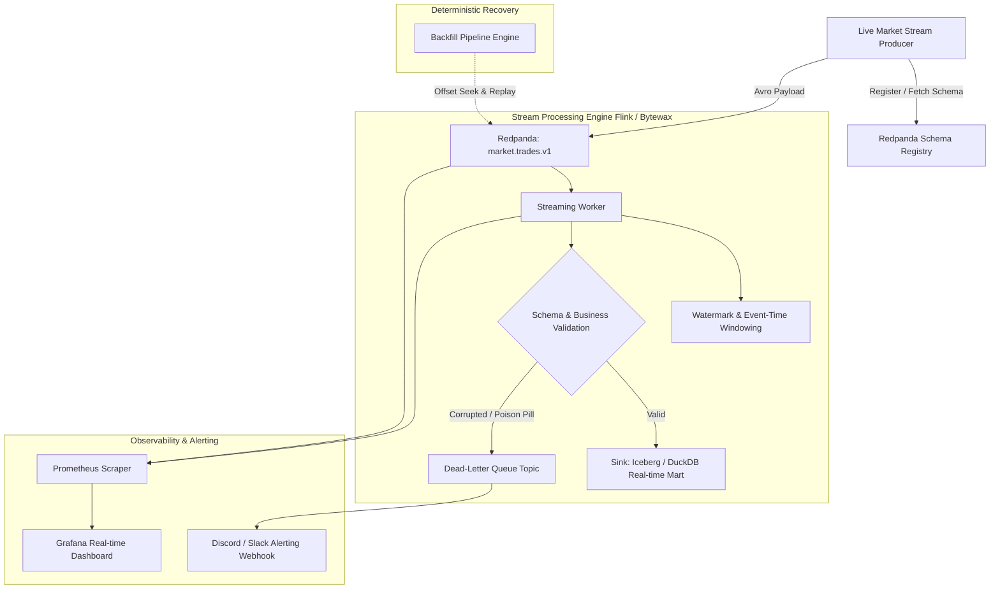

# MASTER SOURCE OF TRUTH (SSoT): PRODUCTION-GRADE DATA ENGINEERING PORTFOLIO

> **Status:** Authoritative Architectural Blueprint & Reference Manual  
> **Target Cost:** $0.00 (Zero recurring cloud spend, 100% locally reproducible, open-source)  
> **Target Audience:** Hiring Managers, Staff/Principal Data Engineers, Technical Recruiters  

---

## TABLE OF CONTENTS
1. [Executive Strategy & Portfolio Thesis](#1-executive-strategy--portfolio-thesis)
2. [Domain & Dataset Selection Strategy](#2-domain--dataset-selection-strategy)
3. [Unified Technology Architecture & Substitution Matrix](#3-unified-technology-architecture--substitution-matrix)
4. [Tier-by-Tier Architectural Specifications](#4-tier-by-tier-architectural-specifications)
   - [Milestone 01: 01_baseline_scripted_ingestion](#milestone-01-01_baseline_scripted_ingestion)
   - [Milestone 02: 02_containerized_scheduled_batch](#milestone-02-02_containerized_scheduled_batch)
   - [Milestone 03: 03_warehouse_modular_mart](#milestone-03-03_warehouse_modular_mart)
   - [Milestone 04: 04_lakehouse_cdc_contracts](#milestone-04-04_lakehouse_cdc_contracts)
   - [Milestone 05: 05_resilient_streaming_platform](#milestone-05-05_resilient_streaming_platform)
5. [Monorepo Structure & Docker Profiles](#5-monorepo-structure--docker-profiles)
6. [Testing, CI/CD & Reliability Engineering](#6-testing-cicd--reliability-engineering)
7. [Zero-Cost Portfolio Presentation & Proof System](#7-zero-cost-portfolio-presentation--proof-system)
8. [The "Hiring Magnet" README Template](#8-the-hiring-magnet-readme-template)
9. [Locked Architectural Decisions & Host Profile](#9-locked-architectural-decisions--host-profile)


---

## 1. EXECUTIVE STRATEGY & PORTFOLIO THESIS

### Why 90% of Data Engineering Portfolios Fail
Most data engineering portfolios fail to convert to senior/staff-level interviews because they commit one of three critical errors:
1. **The "Tutorial Copycat" Trap**: Running a basic Pandas script on the Titanic dataset or copying a generic Kaggle notebook.
2. **The "Unverifiable Cloud Lock-in" Trap**: Putting AWS/Snowflake logos on a README with code snippets that cannot be executed, reviewed, or verified by hiring managers without incurring costs.
3. **The "Happy Path Only" Anti-Pattern**: Building pipelines that only work when incoming data is pristine, completely ignoring network partitions, out-of-order records, schema drift, poison-pill records, and duplicate events.

### The Core Architectural Principles of This Portfolio
Every tier in this repository is governed by strict production engineering standards:
* **Strict Idempotency**: Every pipeline run produces the exact same state, regardless of whether it runs once, fails midway, or is re-executed 10 times.
* **Deterministic Reproducibility**: Any engineer can clone the repo and launch the entire infrastructure via `make up` or `docker compose up` with zero local configuration drift.
* **Data Contracts & Quality Gates**: Bad data is quarantined at the boundary; downstream consumers are never corrupted.
* **Cost-Aware Design**: Leveraging columnar compression, partition pruning, and streaming watermarking to demonstrate an instinctive grasp of infrastructure economics.

---

## 2. DOMAIN & DATASET SELECTION STRATEGY

Instead of building 5 disconnected toy projects, the most impactful portfolio strategy is to **evolve a single high-cardinality, high-frequency domain through all five architectural tiers**.

### Recommended Primary Domain: Global Financial Market & Trade Ledger
* **Why it shines**: Financial data requires microsecond precision, immutable ledgers, out-of-order handling, complex SCD-2 modeling, and zero tolerance for duplicates or missing pennies.
* **Free Public Data Sources**:
  * **Binance / Coinbase Public Websocket & REST API**: Live trades, tick-by-tick order books (L2/L3), liquidation streams (100% free, no auth required).
  * **Yahoo Finance / Open-Meteo**: Macroeconomic feeds and market indicators.
* **Evolution Across Architectural Milestones**:
  * *Milestone 01 (`01_baseline_scripted_ingestion`)*: Bulk CSV ingestion of historical trade ledgers into normalized PostgreSQL (with DuckDB zero-dependency fallback), enforcing primary keys, surrogate hashes, and idempotent UPSERT merges.
  * *Milestone 02 (`02_containerized_scheduled_batch`)*: Multi-stage containerized batch execution with Pydantic configuration, unattended scheduler, and an automated pytest suite covering edge cases.
  * *Milestone 03 (`03_warehouse_modular_mart`)*: Paginated REST API ingestion -> MinIO Snappy Parquet partitions -> DuckDB dimensional star schema (`fct_trades`, `dim_assets`, `dim_exchanges`) transformed via dbt.
  * *Milestone 04 (`04_lakehouse_cdc_contracts`)*: PostgreSQL trade ledger -> Debezium CDC -> Redpanda -> Apache Iceberg ACID Lakehouse with Soda Core quality contracts.
  * *Milestone 05 (`05_resilient_streaming_platform`)*: Live Redpanda WebSocket stream with Avro schema registry -> Bytewax event-time tumbling VWAP calculation -> Dead-Letter Queue (DLQ) -> Prometheus/Grafana real-time lag tracking.


---

## 3. UNIFIED TECHNOLOGY ARCHITECTURE & SUBSTITUTION MATRIX

Every enterprise-grade, expensive cloud tool has an equivalent, highly reliable open-source technology that runs locally inside Docker without costing a cent:

```
┌─────────────────────────────────────────────────────────────────────────────┐
│                           PORTFOLIO TECH STACK MATRIX                       │
├──────────────────────────┬─────────────────────────────┬────────────────────┤
│ Enterprise Paid Tool     │ 100% Free / OSS Alternative │ Portfolio Advantage│
├──────────────────────────┼─────────────────────────────┼────────────────────┤
│ AWS S3 / Google Cloud GCS│ MinIO / LocalStack S3       │ Exact S3 API/Boto3 │
│ Snowflake / BigQuery     │ DuckDB / ClickHouse Local   │ Zero startup cost  │
│ Confluent Cloud / Kafka  │ Redpanda                    │ C++, 1/5th RAM     │
│ Managed Airflow (MWAA)   │ Dagster / Airflow Local     │ Full local UI      │
│ Databricks / Spark Cluster│ PySpark / DuckDB / Polars  │ In-memory speed    │
│ Flink Managed Cluster    │ Apache Flink Standalone     │ True event-time    │
│ Great Expectations Cloud │ Soda Core / GX Open Source  │ Pure YAML contracts│
│ Tableau / PowerBI        │ Evidence.dev / Streamlit    │ Code-as-UI / Git   │
│ Datadog / CloudWatch     │ Prometheus + Grafana        │ Industry standard  │
└──────────────────────────┴─────────────────────────────┴────────────────────┘
```

---

## 4. TIER-BY-TIER ARCHITECTURAL SPECIFICATIONS

---

### Milestone 01: 01_baseline_scripted_ingestion

#### 1. Objective
Ingest raw, uncleaned, high-volume CSV files into a normalized relational database (PostgreSQL 16 with DuckDB local zero-dependency fallback) with schema enforcement, surrogate keys, indexing, and strict UPSERT idempotency.


#### 2. Architecture Diagram


#### 3. Core Deliverables & Implementation Details
* **PostgreSQL Schema (`schema.sql`)**:
  * Normalized 3NF transactional design.
  * Primary keys, foreign key constraints with cascading deletes, `CHECK` constraints, and b-tree indexes on lookup columns.
  * Audit columns: `created_at TIMESTAMP WITH TIME ZONE DEFAULT NOW()`, `updated_at`, `record_hash VARCHAR(64)`.
* **Idempotent Ingestion Engine (`pipeline.py`)**:
  * Uses `psycopg` (v3) binary copy protocol or SQLAlchemy 2.0.
  * **Staging-to-Merge Strategy**: Data is bulk-copied into an unindexed `stg_` table, followed by a set-based atomic SQL upsert:
    ```sql
    INSERT INTO core.market_trades (trade_id, exchange, symbol, price, quantity, trade_timestamp, record_hash)
    SELECT trade_id, exchange, symbol, price, quantity, trade_timestamp, record_hash
    FROM staging.stg_market_trades
    ON CONFLICT (trade_id) DO UPDATE SET
        price = EXCLUDED.price,
        quantity = EXCLUDED.quantity,
        updated_at = NOW()
    WHERE core.market_trades.record_hash != EXCLUDED.record_hash;
    ```
  * Memory guard: Streams files in chunks (`chunksize=50_000`) to guarantee execution under 256MB RAM.

---

### Milestone 02: 02_containerized_scheduled_batch

#### 1. Objective
Eliminate "works on my machine" syndrome by packaging the ingestion system into isolated, multi-stage Docker containers, adding unit and integration tests, and scheduling unattended executions with environment security.

#### 2. Architecture Diagram


#### 3. Core Deliverables & Implementation Details
* **Multi-Stage Dockerfile**:
  * Stage 1 (`builder`): Compiles C-extensions and wheels using `python:3.12-slim`.
  * Stage 2 (`runtime`): Copies only wheels and source code into a non-root distroless/slim user environment (`UID 10001`), reducing image size by >70% and removing attack surfaces.
* **Comprehensive Test Suite (`tests/`)**:
  * **Unit Tests**: Test data cleansing, null-coercion, and regex sanitizers without database connections using `pytest`.
  * **Integration Tests**: Spin up an ephemeral PostgreSQL instance using `testcontainers-python` or Docker Compose service dependencies, verifying schema migrations and upserts.
  * **Negative Edge-Case Tests**: Empty CSV files, files with duplicate primary keys, corrupt headers, and out-of-range timestamps.
* **Configuration Management**:
  * Strongly typed configuration using `pydantic-settings` to ensure the application immediately crashes with actionable errors if an environment variable is missing or malformed.
* **Automated CI/CD (`.github/workflows/ci.yml`)**:
  * Automatically triggers on PRs to run `ruff` (formatting & linting), `mypy` (strict type checking), and `pytest` with code coverage reports.

---

### Milestone 03: 03_warehouse_modular_mart

#### 1. Objective
Extract data from paginated REST APIs, stage compressed columnar files in S3-compatible object storage, partition datasets efficiently, and execute dimensional modeling via dbt.

#### 2. Architecture Diagram


#### 3. Core Deliverables & Implementation Details
* **API Extraction Worker (`extract_api.py`)**:
  * Asynchronous extraction via `httpx` or `aiohttp` handling pagination, exponential backoff, rate-limit retry headers (`429 Too Many Requests`), and jitter.
* **Object Storage & Partitioning**:
  * **MinIO Container**: S3-compatible bucket `s3://lakehouse-raw/`.
  * **Storage Format**: Apache Parquet with Snappy compression and dictionary encoding.
  * **Hive Partitioning**: `s3://lakehouse-raw/market/year=2026/month=03/day=05/batch_id.parquet`.
* **dbt Dimensional Modeling (`dbt_project/`)**:
  * **Engine**: `dbt-duckdb` (or Google BigQuery Sandbox).
  * **Layer 1: Staging (`models/staging/`)**: Casts raw types, renames columns to snake_case, standardizes UTC timestamps.
  * **Layer 2: Intermediate (`models/intermediate/`)**: Joins source streams, deduplicates, and resolves surrogate business keys.
  * **Layer 3: Marts (`models/marts/`)**:
    * `dim_assets`: Type-2 Slowly Changing Dimension (tracking asset symbol changes over time).
    * `fct_trades`: Star-schema fact table optimized for analytical queries.
* **Storage & Query Benchmark Script (`benchmark.py`)**:
  * Quantifies execution time and memory scan bytes across:
    1. Single monolithic CSV (1GB+ uncompressed).
    2. Unpartitioned Parquet.
    3. Partitioned Parquet with partition-pruning queries (`WHERE year = 2026 AND month = 3`).
  * Generates an automated Markdown report (`benchmark_results.md`) included in the repo.

---

### Milestone 04: 04_lakehouse_cdc_contracts

#### 1. Objective
Capture row-level database mutations in near real-time via Change Data Capture (CDC), stream mutations to an open ACID lakehouse format, enforce strict data quality contracts, and expose a semantic query interface.

#### 2. Architecture Diagram


#### 3. Core Deliverables & Implementation Details
* **CDC Engine (Debezium + Redpanda)**:
  * PostgreSQL configured with `wal_level = logical`.
  * Debezium PostgreSQL connector capturing `INSERT`, `UPDATE`, and `DELETE` events into topic `pg.inventory.trades`.
  * Redpanda single-node broker orchestrating event streams.
* **Open Lakehouse Format (Apache Iceberg / Delta Lake)**:
  * Implemented using `pyiceberg` or Python `deltalake` (delta-rs).
  * Supports ACID transactions, schema enforcement, time travel, and file compaction (`OPTIMIZE` / bin-packing).
  * **Merge-on-Read / Copy-on-Write**: Ingestion worker reads CDC log and executes atomic `MERGE INTO` operations against the lakehouse table based on source primary keys.
* **Data Quality Contracts & Quality Gates**:
  * **Soda Core** checks executed via Python API or CLI:
    ```yaml
    checks for fct_trades:
      - row_count > 0
      - missing_count(trade_id) = 0
      - invalid_count(price) = 0:
          valid min: 0.000001
      - freshness(trade_timestamp) < 1h
    ```
  * Automated pipeline breaker: If quality assertions fail, the pipeline halts downstream refreshes and routes notifications.
* **Semantic Layer**:
  * DuckDB analytical views or **Evidence.dev** providing structured business metrics (e.g., Daily Traded Volume, Moving Averages, Exchange Slippage).

---

### Milestone 05: 05_resilient_streaming_platform

#### 1. Objective
Process continuous, un-bounded data streams with automatic schema evolution management, watermarking for out-of-order records, dead-letter queue (DLQ) fault recovery, end-to-end observability, and deterministic historical backfills.

#### 2. Architecture Diagram


#### 3. Core Deliverables & Implementation Details
* **Schema Evolution & Confluent-Compatible Registry**:
  * Redpanda built-in Schema Registry running on port 8081.
  * Schema defined via Apache Avro (`trade_event.avsc`).
  * Evolution demonstration: Register `v1` (strict fields), then deploy `v2` (adding optional field `trade_type` with default).
  * Compatibility level set to `BACKWARD` to guarantee that new code versions can read older messages without pipeline crashes.
* **Streaming Engine (Apache Flink / Bytewax)**:
  * **Event-Time Processing**: Extracts embedded event timestamps rather than system arrival times.
  * **Bounded Out-of-Order Watermarking**: Configured with a 5-second bounded out-of-orderness delay to capture late-arriving network events.
  * **Windowed Aggregations**: 1-minute and 5-minute Tumbling Windows computing real-time OHLCV (Open, High, Low, Close, Volume) metrics.
* **Dead-Letter Queue (DLQ) & Circuit Breaker**:
  * Poison-pill records (malformed Avro bytes, negative prices, null IDs) are isolated via `try/except` stream handlers.
  * Payloads are wrapped with diagnostic headers (`error_message`, `stack_trace`, `failed_at_utc`, `original_topic`) and routed to `market.trades.dlq`.
  * Triggers an automated webhook alert to Discord/Slack with error metadata.
* **Deterministic Historical Backfill Pipeline**:
  * A dedicated backfill CLI (`backfill.py --from 2026-03-01T00:00:00 --to 2026-03-02T00:00:00 --dry-run`):
  * Resets consumer offsets or replays immutable Parquet archives directly through the transformation engine into isolated staging tables, preventing state pollution.
* **Full-Stack Observability Dashboard**:
  * **Prometheus**: Scrapes metrics from Redpanda, Flink, and the Python workers.
  * **Grafana**: Pre-configured JSON dashboard monitoring:
    1. **Consumer Group Lag** (per partition).
    2. **End-to-End Latency** (Event Time vs. Processing Time).
    3. **Ingestion Throughput** (Records/sec and Bytes/sec).
    4. **DLQ Failure Rate** (Failures/min).

---

## 5. MONOREPO STRUCTURE & AUDIT PRESERVATION ARCHITECTURE

To ensure every milestone's code is strictly preserved for technical auditing and recruiter inspection, the repository uses a **Hybrid Monorepo with Autonomous Milestones**. Each milestone folder is self-contained with its own schema definitions, pipeline code, and dedicated audit README (`AUDIT_REPORT.md` / `README.md`), while sharing common Docker and root configurations:

```
data-engineering-mastery/
├── .github/
│   └── workflows/
│       ├── ci.yml                    # Automated tests, lints, type-checks
│       └── deploy_docs.yml           # Deploys dbt docs & Data Docs to GitHub Pages
├── config/
│   ├── debezium/                     # Debezium Postgres connector JSON config
│   ├── grafana/                      # Provisioned Grafana datasources and dashboards
│   ├── prometheus/                   # Prometheus scrape configurations
│   └── schemas/                      # Avro & JSON Schema definitions
├── dbt_project/                      # Milestone 03 dbt models (staging, intermediate, marts)
│   ├── models/
│   ├── dbt_project.yml
│   └── profiles.yml
├── docker/
│   ├── app.Dockerfile               # Multi-stage Python application image
│   └── docker-compose.yml            # Unified Compose file with profiles
├── docs/                             # Architecture diagrams, benchmark reports
├── src/
│   ├── common/                       # Shared logging, config (Pydantic), db connection utilities
│   ├── 01_baseline_scripted_ingestion/
│   │   ├── README.md                 # Standalone audit instructions & execution steps
│   │   ├── schema.sql                # Relational schema (DDL, constraints, indexes)
│   │   ├── pipeline.py               # Idempotent CSV ingestion engine (Postgres + DuckDB fallback)
│   │   └── generate_sample_data.py   # High-volume stress fixture & mock generator
│   ├── 02_containerized_scheduled_batch/
│   │   ├── README.md                 # Containerization & scheduler audit documentation
│   │   ├── Dockerfile                # Multi-stage isolated container build
│   │   ├── scheduler.py              # Lightweight unattended batch scheduler
│   │   └── runner.py                 # Batch entry point with Pydantic settings
│   ├── 03_warehouse_modular_mart/
│   │   ├── README.md                 # Data lake & dbt modeling audit documentation
│   │   ├── extract_api.py            # Async paginated REST API extractor
│   │   ├── parquet_writer.py         # Snappy-compressed Hive-partitioned storage engine
│   │   └── benchmark.py              # Partitioned vs unpartitioned performance benchmark
│   ├── 04_lakehouse_cdc_contracts/
│   │   ├── README.md                 # CDC & Iceberg lakehouse audit documentation
│   │   ├── cdc_consumer.py           # Debezium change event subscriber
│   │   ├── iceberg_writer.py         # ACID Lakehouse merge/compaction engine
│   │   └── quality_gates.py          # Soda Core contract enforcement & circuit breaker
│   └── 05_resilient_streaming_platform/
│       ├── README.md                 # Real-time streaming & recovery audit documentation
│       ├── streaming_engine.py       # Bytewax dataflow with watermarking & tumbling windows
│       ├── dlq_handler.py            # Dead-Letter Queue router with webhook alerting
│       ├── schema_evolution.py       # Avro schema evolution compatibility runner
│       └── backfill.py               # Deterministic historical replay CLI
├── tests/
│   ├── unit/                         # Unit tests asserting sanitization, hashes, type coercions
│   ├── integration/                  # Integration tests with PostgreSQL and MinIO
│   └── fixtures/                     # Test CSVs, corrupt files, mock API payloads
├── .env.example                      # Template environment variables
├── Makefile                          # Universal task automation commands
├── pyproject.toml                    # Poetry/Pip dependencies and tool configurations
└── README.md                         # The recruiter-optimized project landing page
```

### Docker Compose Profiles Strategy
Running all containers at once (Postgres, MinIO, Redpanda, Prometheus, Grafana) can overload a development machine. Use **Docker Profiles** in `docker-compose.yml`:

* `docker compose --profile milestone-01 up -d` -> Starts only PostgreSQL (tuned shared_buffers).
* `docker compose --profile milestone-03 up -d` -> Starts MinIO and PostgreSQL.
* `docker compose --profile milestone-04 up -d` -> Starts PostgreSQL, Debezium, Redpanda, MinIO.
* `docker compose --profile full up -d`         -> Launches the entire platform.


---

## 6. TESTING, CI/CD & RELIABILITY ENGINEERING

```
┌────────────────────────────────────────────────────────────────────────┐
│                        TESTING PYRAMID FOR DATA                        │
├───────────────────┬───────────────────────────────┬────────────────────┤
│ Test Type         │ Target Component              │ Tooling            │
├───────────────────┼───────────────────────────────┼────────────────────┤
│ Code Unit Tests   │ Sanitizers, Coercion, Parsers │ pytest, ruff, mypy │
│ Integration Tests │ Database Upserts, API Clients │ testcontainers-pg  │
│ Data Contracts    │ Schema Drift, Null Checks     │ Soda Core / GX     │
│ Transformation    │ dbt Models, Star Schemas      │ dbt test           │
│ Streaming E2E     │ Watermark & Window Output     │ pytest-asyncio     │
└───────────────────┴───────────────────────────────┴────────────────────┘
```

### Automated GitHub Actions Workflow (`ci.yml`)
Every pull request automatically triggers a GitHub Actions matrix that runs:
1. **Linter & Formatting**: `ruff check .` and `ruff format --check .`
2. **Type Safety**: `mypy --strict src/`
3. **Unit Tests**: `pytest tests/unit`
4. **Data Contract Tests**: Validates mock batches against Soda Core YAML specifications.

---

## 7. ZERO-COST PORTFOLIO PRESENTATION & PROOF SYSTEM

Hiring managers spend an average of **90 seconds** evaluating a candidate's GitHub repository. To capture attention immediately, your project must provide instant visual proof without requiring them to run code.

### 1. Interactive Proof Deployed for Free
* **dbt Docs on GitHub Pages**:
  * Run `dbt docs generate`.
  * Use a GitHub Action to deploy `target/` directly to GitHub Pages (`username.github.io/data-engineering-mastery/dbt`).
  * Reviewers can click through your full DAG lineage graph, data dictionary, and SQL code in their browser.
* **Data Quality Reports on GitHub Pages**:
  * Host the HTML reports generated by Soda Core / Great Expectations Data Docs.
* **Interactive Live UI ($0)**:
  * Deploy an **Evidence.dev** or **Streamlit Community Cloud** dashboard connected to DuckDB/MotherDuck to let reviewers interact with the modeled metrics live.

### 2. High-Fidelity Visual Proof in README
* **Terminal Screencasts**: Use [VHS (charm.sh)](https://github.com/charmbracelet/vhs) to generate high-resolution terminal execution GIFs showing:
  1. The pipeline starting via `make up`.
  2. Late-arriving events being caught and routed to the DLQ in real-time.
  3. `pytest` passing with green checkmarks.
* **Grafana Dashboard Screenshots**:
  * High-resolution screenshots of consumer lag dropping to zero during peak streaming ingestion.
  * Real-time throughput graphs during backfill replays.
* **Architecture Diagrams**:
  * Clean, professional Mermaid.js diagrams embedded directly in the README (renders natively on GitHub).

---

## 8. THE "HIRING MAGNET" README TEMPLATE

Use this exact structure for the repository's root `README.md`:

```markdown
# Real-Time Financial Market Lakehouse & Resilient Streaming Engine

[](https://github.com/yourname/data-engineering-mastery)
[](https://yourname.github.io/data-engineering-mastery/dbt)
[](https://yourname.github.io/data-engineering-mastery/soda)

## 📌 Executive Summary
An end-to-end, production-grade data engineering platform demonstrating the evolution from simple batch ingestion to an ACID Lakehouse and an event-driven streaming cluster. Built with 100% open-source tooling, zero cloud licensing costs, and complete single-command local reproducibility.

## 🏗️ System Architecture
[Embed Mermaid Diagram Here]

## ⚡ Quickstart (One-Command Reproducibility)
Clone the repo and run the full stack locally:
```bash
git clone https://github.com/yourname/data-engineering-mastery.git
cd data-engineering-mastery
cp .env.example .env
make up          # Launches Redpanda, MinIO, Postgres, and Workers
make test        # Runs unit & integration test suite
make stream      # Starts live market trade generation and Flink worker
```

## 📊 Live Deliverables & Interactive Proof
* 🔗 [Browse the Live dbt Documentation & Lineage DAG](https://yourname.github.io/...)
* 🔗 [Inspect the Automated Data Quality Reports](https://yourname.github.io/...)
* 📈 [View Performance & Cost Benchmark Study](docs/benchmark_results.md)

## 🛠️ Deep-Dive Architectural Breakdown
- [Milestone 01: Baseline Scripted Ingestion Engine](src/01_baseline_scripted_ingestion/)
- [Milestone 02: Containerized Workflow with Pytest Matrix](src/02_containerized_scheduled_batch/)
- [Milestone 03: Partitioned Lake Storage & Dimensional Modeling](src/03_warehouse_modular_mart/)
- [Milestone 04: Real-Time CDC with Debezium & Apache Iceberg](src/04_lakehouse_cdc_contracts/)
- [Milestone 05: Resilient Streaming, Schema Evolution, & DLQ](src/05_resilient_streaming_platform/)
```


---

## 9. LOCKED ARCHITECTURAL DECISIONS & HOST PROFILE

The following architectural choices have been permanently locked for this repository based on technical constraints and target career objectives:

### Host Hardware & Environment Specifications
* **Host OS**: Microsoft Windows 11 Home (x64-based PC, Lenovo 82K2)
* **Processor**: AMD Ryzen 5000 Series (AMD64 Family 25 Model 80, ~1908-3300 MHz, 6 cores / 12 threads)
* **Total Physical RAM**: 14,188 MB (~16 GB installed)
* **Available Physical RAM Strategy**: Current available free RAM is ~2.1 GB. To prevent paging and thrashing:
  * We enforce **Modular Docker Profiles** (`--profile d-tier`, `--profile c-tier`, etc.).
  * Avoid heavy JVM runtimes; we select **Bytewax** (Rust + Python, <150MB RAM) over Apache Flink (~1.5GB JVM).
  * Use **PostgreSQL 16 Alpine** with tuned memory limits (`shared_buffers=128MB`, `work_mem=4MB`).
  * In-memory analytical layer leverages **DuckDB** (sub-50MB overhead, zero daemon process).
* **Container Engine**: Docker Desktop on Windows with WSL2 backend.

### Engineering & Domain Specifications
* **Primary Domain**: **Option A — Global Financial Market & Trade Ledger** (Binance public tick feeds, Coinbase order book snapshots, historical crypto/FX trade ledgers).
* **Streaming Engine**: **Bytewax** (Timely Dataflow in Rust with Python interface, high-throughput, sub-second watermarking, ultra-low memory footprint).
* **Lakehouse Standard**: **Apache Iceberg** (PyIceberg + MinIO S3 object storage; industry standard for modern multi-engine query systems).
* **Quality Gate & Poison Pill Strategy**: **Option B — Quarantine & Dead-Letter Queue (DLQ)** with automated webhook alerting. Clean records continue downstream without pipeline downtime.
* **Target Career Persona**: **Core Data Engineer (Generalist)** (demonstrating end-to-end fluency in relational schema design, idempotency, containerization, dbt dimensional modeling, lakehouse storage, and streaming reliability).

