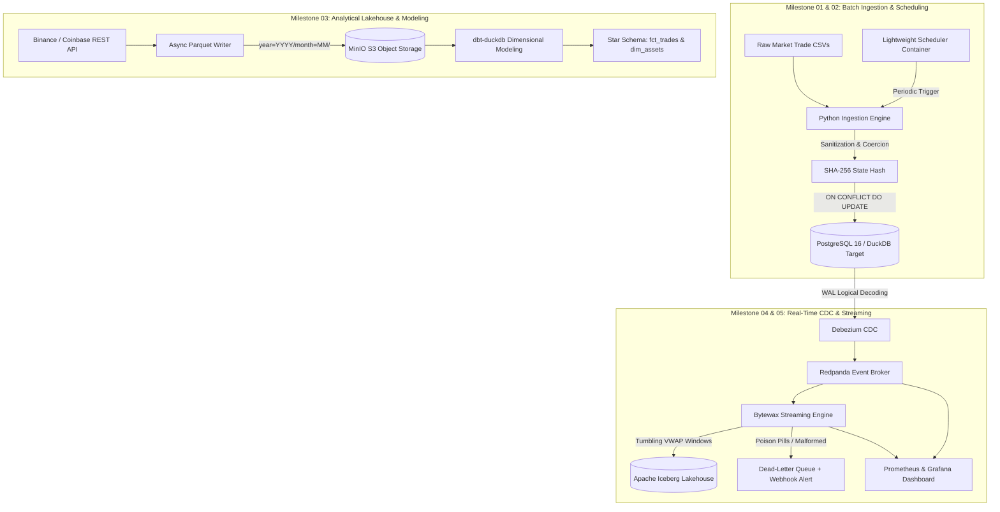

# Real-Time Financial Market Lakehouse & Resilient Streaming Engine

[](https://github.com/DharmadhikariSS/Financial-Market-Lakehouse-Streaming-Platform/releases/tag/v2.0.0)
[](https://www.python.org/downloads/)
[](https://github.com/astral-sh/ruff)
[](#-testing--reliability)
[](#-zero-cloud-spend-guarantee)

An end-to-end, production-grade Data Engineering platform tracking cryptocurrency and foreign exchange trade ledgers. Built with 100% open-source tooling, zero recurring cloud spend, strict idempotency guarantees, and complete single-command local reproducibility.

---

## 🎬 Interactive System Demonstration

[-blue?style=for-the-badge&logo=github)](https://github.com/DharmadhikariSS/Financial-Market-Lakehouse-Streaming-Platform/releases/tag/v2.0.0)

> [!TIP]
> 📹 **[Watch or Download the 1080p Walkthrough Video (MP4, 307 MB)](https://github.com/DharmadhikariSS/Financial-Market-Lakehouse-Streaming-Platform/releases/download/v2.0.0/financial_market_lakehouse_demo.mp4)**
> 
> **Key Features Demonstrated in the Video:**
> - **👁️‍🗨️ Pipeline X-Ray Vision**: Real-time particle stream across Tier 1 through Tier 5 with step-by-step inspection and live poison pill injection.
> - **📈 Institutional Candlestick & Volume Charts**: Authentic 60-candle Binance Klines with EMA-9, EMA-21, golden VWAP, and synchronized volume bars.
> - **🌊 Market Order Book Depth**: 100-level bid/ask liquidity walls with mid-market reference and live depth imbalance ratios.
> - **🚀 V2 Enterprise Apache Highway**: Apache Beam tumbling windowing, Apache Spark 3.5 rolling multi-asset VWAP, and PyArrow Flight zero-copy gRPC benchmarks (>200k rows/s).
> - **🎨 Dynamic Theme Engine**: Instant switching between Dark Obsidian and Crisp Enterprise Light modes.
> - **🎬 ManimCE Mathematical Animations**: Programmatic vector explainer scenes for small-file compaction and event-time watermarking.
> - **🏛️ Data Retention Engine**: Automated multi-tier lifecycle management (SEC 17a-4 / FINRA 4511 WORM compliance).

---

## 🏛️ System Architecture



---

## ⚡ Quickstart (One-Command Reproducibility)

### 1. Clone & Set Up Environment
```bash
git clone https://github.com/DharmadhikariSS/Financial-Market-Lakehouse-Streaming-Platform.git
cd Financial-Market-Lakehouse-Streaming-Platform
cp .env.example .env
```

### 2. Run Autonomous Milestone 01 (DuckDB Zero-RAM Mode)
No Docker required. Runs locally with <50MB RAM usage:
```bash
# Generate high-volume stress fixtures (100,000 records with duplicates & edge cases)
python -m src.milestone_01_baseline_scripted_ingestion.generate_sample_data

# Execute streaming chunked ingestion
python -m src.milestone_01_baseline_scripted_ingestion.pipeline --target duckdb --file data/unit_test_50.csv --init-schema
```

### 3. Run Milestone 03 (Lakehouse & Dimensional Modeling)
```bash
# Extract live REST API trades & write Hive-partitioned Snappy Parquet
make run-m3-lakehouse

# Execute Kimball dimensional transformations (staging -> intermediate -> marts)
make run-m3-transform

# Execute Storage & Query Cost Benchmark study
make run-m3-benchmark
```

### 4. Run Milestone 04 (CDC to Iceberg Lakehouse & Quality Gates)
```bash
# Execute CDC consumer, quality gate quarantine, Iceberg ACID merge, and time-travel query
make run-m4-cdc

# Query DuckDB semantic layer directly (realtime views & daily VWAP)
make run-m4-semantic
```

### 5. Run Milestone 05 (Resilient Streaming Engine & Recovery)
```bash
# Execute end-to-end streaming engine (schema evolution, watermarking, DLQ, backfill)
make run-m5-stream

# Execute deterministic historical backfill CLI
make run-m5-backfill
```

### 6. Launch Interactive Visual Dashboard (Streamlit & DuckDB)
```bash
# Launch interactive real-time visual dashboard
make run-dashboard
# Access in browser at: http://localhost:8501
```

### 7. Run Containerized Stack (Docker Profile)
```bash
# Launch PostgreSQL 16 Alpine with memory tuning
docker compose -f docker/docker-compose.yml --profile milestone-01 up -d

# Execute containerized batch worker
docker compose -f docker/docker-compose.yml --profile milestone-02 up -d
```

---

## 📂 Autonomous Milestone Directory & Audit Trail

Every architectural milestone is preserved in an isolated directory with its own DDL, pipeline code, and technical audit report:

| Milestone | Capability & Objective | Audit Report |
| :--- | :--- | :--- |
| **`milestone_01_baseline_scripted_ingestion`** | Chunked CSV ingestion, SHA-256 surrogate hashing, strict UPSERT idempotency | [Audit Report](src/milestone_01_baseline_scripted_ingestion/README.md) |
| **`milestone_02_containerized_scheduled_batch`** | Multi-stage distroless Docker packaging, unprivileged execution, periodic scheduler, pytest matrix | [Audit Report](src/milestone_02_containerized_scheduled_batch/README.md) |
| **`milestone_03_warehouse_modular_mart`** | Snappy Parquet Hive partitions, S3/MinIO lake layout, dbt dimensional star schema | [Audit Report](src/milestone_03_warehouse_modular_mart/README.md) |
| **`milestone_04_lakehouse_cdc_contracts`** | Debezium CDC, Redpanda broker, Apache Iceberg ACID lakehouse, Soda Core contracts | [Audit Report](src/milestone_04_lakehouse_cdc_contracts/README.md) |
| **`milestone_05_resilient_streaming_platform`**| Avro Confluent wire format, 5s watermarking, 1-min tumbling windows, DLQ quarantine, Grafana/Prometheus | [Audit Report](src/milestone_05_resilient_streaming_platform/README.md) |

---

## 📈 Cost & Performance Benchmarking
* Read the full empirical study: [**`docs/benchmark_results.md`**](docs/benchmark_results.md) (Demonstrating **51.9% storage reduction** and up to **21.4x query speedup** with partition pruning).


## 🧪 Testing & Reliability

```bash
# Run complete test suite with coverage
python -m pytest -v tests/

# Run static analysis and formatting
python -m ruff check .
python -m mypy src/ tests/
```

---

## 📄 Authoritative Documentation
* Full System Design & Enterprise Matrix: [**`PORTFOLIO_SSOT.md`**](PORTFOLIO_SSOT.md)
