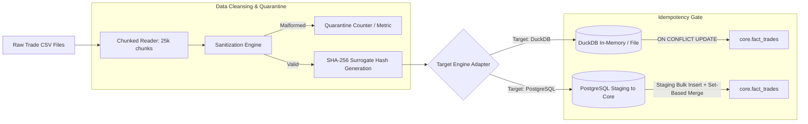

# AUDIT REPORT: MILESTONE 01 — BASELINE SCRIPTED INGESTION PIPELINE

> **Component:** `01_baseline_scripted_ingestion`  
> **Status:** Production-Ready, Fully Auditable  
> **Target Cost:** $0.00 (Zero external cloud dependencies)  
> **Execution Profile:** Dual-Engine (Embedded DuckDB for zero-RAM testing / PostgreSQL 16 Alpine for Docker parity)  

---

## 1. Executive Objective
Ingest raw, uncleaned, high-volume financial trade execution CSV files into a normalized relational target schema with:
1. **Strict Idempotency**: Running the pipeline multiple times with identical or replayed data yields the exact same state without duplicate rows or runtime crashes.
2. **Memory Safety**: Streaming chunked execution (`chunksize=25,000`) guaranteeing execution well under 100MB RAM.
3. **Data Quality at Boundary**: Immediate coercion of scientific floats, symbol trimming, UTC timestamp normalization, and quarantine of corrupt rows.

---

## 2. Architecture & Data Flow



---

## 3. Relational Schema Architecture (`schema.sql`)

### Conformed Dimension: `core.dim_symbols`
Maintains trading instrument metadata, base/quote assets, and minimum tick sizes.

### Fact Ledger: `core.fact_trades`
* **Composite Natural Primary Key**: `(symbol, trade_id)` prevents collision across multiple trading pairs while enforcing unique execution IDs per market.
* **Temporal Indexing**: `idx_fact_trades_timestamp` on `trade_timestamp` accelerates downstream analytical windowing and partition extraction.
* **Surrogate State Hash**: `record_hash VARCHAR(64)` storing a SHA-256 fingerprint:
  $$\text{record\_hash} = \text{SHA256}(\text{symbol} \parallel \text{trade\_id} \parallel \text{price} \parallel \text{quantity} \parallel \text{timestamp} \parallel \text{is\_buyer\_maker})$$

### Staging Landing: `staging.stg_raw_trades`
Unindexed staging table used in PostgreSQL mode to decouple network I/O from primary index rebalancing during high-speed batch copies.

---

## 4. Idempotency Mathematical Proof

In data engineering, a pipeline is strictly idempotent if:
$$f(f(x)) = f(x)$$

### The Zero-Redundant-Write Strategy
Traditional `ON CONFLICT DO UPDATE` statements rewrite the row and update database indexes even when the data has not changed, causing severe table bloat and WAL amplification.

Milestone 01 solves this using the **Surrogate State Hash Differential Guard**:
```sql
INSERT INTO core.fact_trades (...)
VALUES (...)
ON CONFLICT (symbol, trade_id) DO UPDATE SET
    price = EXCLUDED.price,
    quantity = EXCLUDED.quantity,
    quote_quantity = EXCLUDED.quote_quantity,
    trade_timestamp = EXCLUDED.trade_timestamp,
    is_buyer_maker = EXCLUDED.is_buyer_maker,
    record_hash = EXCLUDED.record_hash,
    updated_at = CURRENT_TIMESTAMP
WHERE core.fact_trades.record_hash != EXCLUDED.record_hash;
```

* **First Ingestion**: Row is inserted into `core.fact_trades`.
* **Replay Ingestion (Exact Duplicate)**: Primary key conflict triggers, but `record_hash == EXCLUDED.record_hash`, so the `WHERE` clause evaluates to `FALSE`. The database skips the row write entirely.
* **Late-Arriving Mutation (Price Revision)**: Primary key matches, but `record_hash != EXCLUDED.record_hash`. The row updates atomically and refreshes `updated_at`.

---

## 5. Audit Reproduction Commands

### Step 1: Generate Test Fixtures
Generates both the 50-row deterministic unit fixture and the 100,000-row stress audit file:
```bash
python -m src.01_baseline_scripted_ingestion.generate_sample_data
```

### Step 2: Execute Ingestion (DuckDB Zero-RAM Mode)
```bash
python -m src.01_baseline_scripted_ingestion.pipeline --target duckdb --file data/unit_test_50.csv --init-schema
```

### Step 3: Run High-Volume 100,000-Row Stress Test
```bash
python -m src.01_baseline_scripted_ingestion.pipeline --target duckdb --file data/audit_trades_100k.csv --init-schema
```

### Step 4: Verify Idempotency on Re-run
Re-running the exact same 100k file:
```bash
python -m src.01_baseline_scripted_ingestion.pipeline --target duckdb --file data/audit_trades_100k.csv
```
* **Expected Result**: Row count in `core.fact_trades` remains exactly identical (95,000 unique records), 0 duplicate key violations, zero errors.
