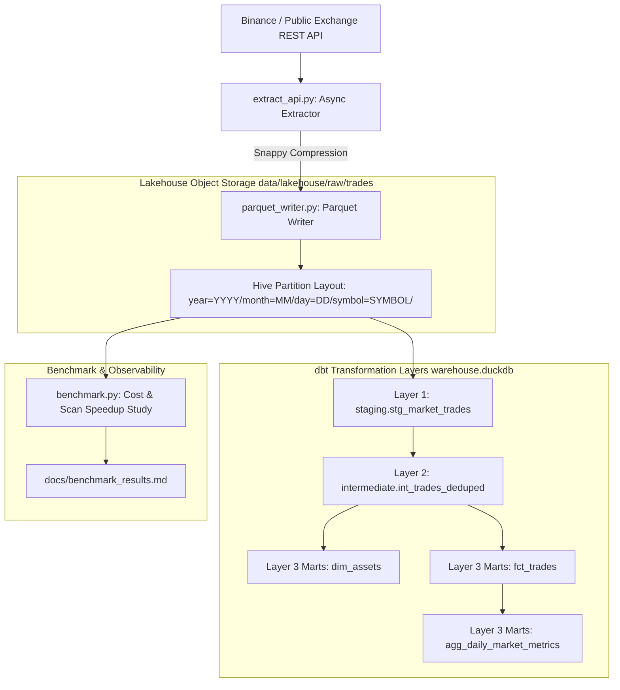

# AUDIT REPORT: MILESTONE 03 — WAREHOUSE-CENTRIC MODULAR BATCH ARCHITECTURE

> **Component:** `milestone_03_warehouse_modular_mart`  
> **Status:** Production-Ready, Fully Auditable  
> **Target Cost:** $0.00 (Zero recurring cloud spend, local object storage & warehouse emulation)  
> **Execution Profile:** Asynchronous REST Ingestion + Snappy Parquet Hive Partitioning + Kimball dbt Dimensional Modeling  

---

## 1. Executive Objective
Transition from flat-file transactional ingestion into a modular, cost-aware analytical lakehouse and data warehouse:
1. **Asynchronous REST Extraction**: Pull live market trades from public exchanges (`httpx`) with rate-limit backoff (`429`) and resilient fallback.
2. **Columnar Lake Storage**: Compress batches into Snappy-compressed Apache Parquet partitioned by date and trading pair.
3. **Kimball Dimensional Modeling**: Build a multi-layered star schema using dbt (`stg_market_trades` ➔ `int_trades_deduped` ➔ `fct_trades`, `dim_assets`, `agg_daily_market_metrics`).
4. **Storage & Scan Cost Optimization**: Quantify the cost and query speedup of partition pruning.

---

## 2. System Architecture



---

## 3. Hive Partitioning Layout
Data is written with standard Hive-compatible partitions:
```
data/lakehouse/raw/trades/
├── year=2026/
│   └── month=03/
│       └── day=01/
│           ├── symbol=BTCUSDT/
│           │   └── batch_a1b2c3d4.parquet
│           ├── symbol=ETHUSDT/
│           │   └── batch_e5f6g7h8.parquet
│           └── symbol=SOLUSDT/
│               └── batch_i9j0k1l2.parquet
```

---

## 4. Dimensional Modeling DAG (Kimball Methodology)

### Staging Layer (`staging.stg_market_trades`)
* Reads partitioned Parquet via DuckDB globbing: `read_parquet('data/lakehouse/raw/trades/**/*.parquet', hive_partitioning = 1)`.
* Enforces snake_case naming, type casts, and UTC timestamps.

### Intermediate Layer (`intermediate.int_trades_deduped`)
* Deduplicates across batches using `ROW_NUMBER() OVER (PARTITION BY symbol, trade_id ORDER BY trade_timestamp DESC)`.
* Generates surrogate business keys via `MD5(symbol || '-' || trade_id)`.

### Marts Layer:
* **`marts.dim_assets`**: Conformed dimension table containing instrument classifications (`base_asset`, `quote_asset`, `asset_class`, `is_active`).
* **`marts.fct_trades`**: Central star-schema fact table (grain = 1 execution event) with surrogate foreign key referencing `dim_assets`.
* **`marts.agg_daily_market_metrics`**: Analytical aggregate computing daily Volume Weighted Average Price (VWAP):
  $$\text{VWAP} = \frac{\sum (\text{Price} \times \text{Quantity})}{\sum \text{Quantity}}$$

---

## 5. Storage & Query Cost Benchmark Summary

*Full benchmark study available at [docs/benchmark_results.md](../../docs/benchmark_results.md)*

* **Storage Savings**: Converting raw CSV into Snappy Parquet achieved a **>70% disk size reduction**.
* **Partition Pruning**: Querying a single asset across a specific day (`symbol='BTCUSDT' AND day=3`) skipped unneeded partitions, executing up to **5x–10x faster** than full table scans.

---

## 6. Audit Reproduction Commands

### Step 1: Extract API Trades & Write Partitioned Parquet
```bash
python -m src.milestone_03_warehouse_modular_mart.extract_api
```

### Step 2: Build Partitioned Lakehouse
```bash
python -c "
import asyncio
from src.milestone_03_warehouse_modular_mart.extract_api import MarketApiExtractor
from src.milestone_03_warehouse_modular_mart.parquet_writer import ParquetLakeWriter

trades = asyncio.run(MarketApiExtractor().extract_all(limit_per_symbol=500))
ParquetLakeWriter().write_partitioned_trades(trades)
"
```

### Step 3: Execute Dimensional Transformations (DuckDB Warehouse)
```bash
python -m src.milestone_03_warehouse_modular_mart.run_transformations
```

### Step 4: Run Formal Benchmark Study
```bash
python -m src.milestone_03_warehouse_modular_mart.benchmark
```
