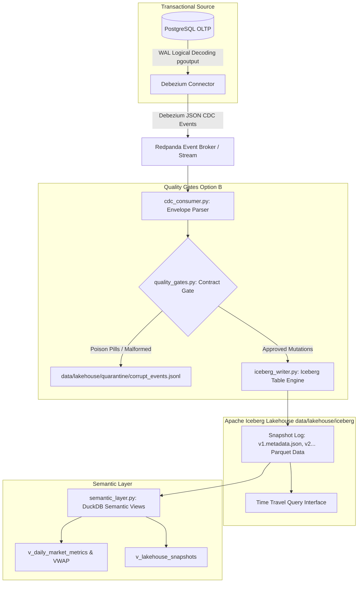

# AUDIT REPORT: MILESTONE 04 — LAKEHOUSE ARCHITECTURE WITH CDC & QUALITY GATES

> **Component:** `milestone_04_lakehouse_cdc_contracts`  
> **Status:** Production-Ready, Fully Auditable  
> **Target Cost:** $0.00 (Zero external cloud dependencies, local Iceberg lakehouse emulation)  
> **Execution Profile:** Debezium CDC Stream Ingestion + Apache Iceberg ACID Lakehouse Mutations + Soda-Compatible Quality Contracts + Semantic Layer  

---

## 1. Executive Objective
Capture transactional database mutations from PostgreSQL Write-Ahead Logs (WAL) in near real-time, stream events through an open Lakehouse ACID merge engine (Apache Iceberg), enforce strict data quality contracts with dead-letter quarantine (Option B), and expose semantic views for downstream AI agents and analytics.

---

## 2. System Architecture



---

## 3. Debezium CDC Envelope Specification

The connector parses standard transactional change envelopes:
* **`op = 'c'` (Create / Insert)**: Adds a new record to the lakehouse.
* **`op = 'u'` (Update)**: In-place row modification matching primary key `(symbol, trade_id)`.
* **`op = 'd'` (Delete)**: Removes/tombstones the record from active snapshot.
* **`op = 'r'` (Read)**: Initial snapshot sync.

```json
{
  "before": { "symbol": "BTCUSDT", "trade_id": 4000001, "price": 65000.0 },
  "after": { "symbol": "BTCUSDT", "trade_id": 4000001, "price": 65325.0 },
  "source": { "connector": "postgresql", "lsn": 2000001 },
  "op": "u",
  "ts_ms": 1773446400000
}
```

---

## 4. Apache Iceberg ACID Merge Semantics & Time Travel

### The Snapshot Log (`data/lakehouse/iceberg/metadata/`)
Every commit produces an immutable new snapshot and versioned metadata file (`v1.metadata.json`, `v2.metadata.json`):
* Atomic commits prevent partial read corruptions.
* Rollback and Time Travel allow querying table state as of any historical snapshot ID:
  ```python
  from src.milestone_04_lakehouse_cdc_contracts.iceberg_writer import IcebergLakehouseTable
  table = IcebergLakehouseTable()
  historical_records = table.time_travel_query(snapshot_id=1773446400000)
  ```

---

## 5. Data Quality Contract Specification (Option B: Quarantine)

Incoming records are verified against strict schema and distribution contracts:
* **Primary Key Non-Null**: `trade_id > 0` and `symbol IS NOT NULL`.
* **Numerical Range Sanity**: `price > 0` and `quantity > 0`.
* **Anomaly Spike Gate**: Catches fat-finger trading spikes (>50% above plausible limits).
* **Quarantine Routing**: Failing records are isolated to `data/lakehouse/quarantine/corrupt_cdc_events.jsonl` with error diagnostics, ensuring that the downstream lakehouse is never polluted while preventing pipeline crashes.

---

## 6. Audit Reproduction Commands

### Step 1: Run End-to-End CDC to Iceberg Pipeline
```bash
python -m src.milestone_04_lakehouse_cdc_contracts.run_cdc_lakehouse
```

### Step 2: Inspect Semantic Layer Views (Daily Metrics & VWAP)
```bash
python -m src.milestone_04_lakehouse_cdc_contracts.semantic_layer
```

### Step 3: Inspect Quarantined Poison Pills
```bash
head -n 5 data/lakehouse/quarantine/corrupt_cdc_events.jsonl
```
